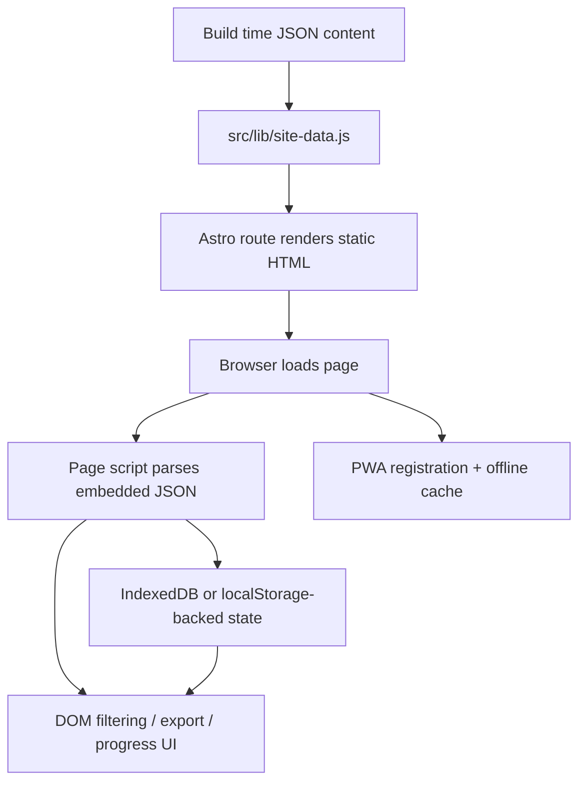

# 01 System Architecture

## Purpose of this document

Explain what kind of app this is, how it runs, what the main architectural layers are, and what constraints shape the implementation.

## What to inspect in the repo first

- `astro.config.mjs`
- `src/layouts/Layout.astro`
- `src/lib/site-data.js`
- `src/pages/`
- `src/scripts/`
- `src/scripts/idb-kv.js`

## Observed implementation

This is a static Astro app configured with `output: 'static'` in `astro.config.mjs`. Astro renders HTML at build time, then page-specific vanilla JS modules attach client behavior after load.

The app has two practical layers:

- Layer A: public study companion routes such as `/`, `/roadmap/`, `/weeks/<slug>/`, `/glossary/`, `/flashcards/`, `/progress/`, `/resources/`, `/security-journal/`, `/about/`, and `/offline/`
- Layer B: a private local notes workspace at `/notes/`

The content model is prebuilt JSON:

- `src/data/content/study-companion-v2.json`
- `src/data/content/glossary.json`
- `src/data/content/flashcards.json`
- `src/data/workbook-enrichment.json`
- `src/data/day-source-links.json`

The normalization layer is `src/lib/site-data.js`. It converts raw JSON into route-friendly objects, maps days to weeks, decorates glossary and flashcards with usage metadata, and exposes precomputed collections such as `weeks`, `glossaryEntries`, and `flashcardEntries`.

Interactivity is mostly route-specific and implemented with small modules in `src/scripts/`. Persistence is handled in-browser through IndexedDB with localStorage fallback and migration.

## Route map

- `/` -> `src/pages/index.astro`
- `/roadmap/` -> `src/pages/roadmap/index.astro`
- `/weeks/<slug>/` -> `src/pages/weeks/[...slug].astro`
- `/glossary/` -> `src/pages/glossary/index.astro`
- `/flashcards/` -> `src/pages/flashcards/index.astro`
- `/flashcards/export/` -> `src/pages/flashcards/export/index.astro`
- `/progress/` -> `src/pages/progress/index.astro`
- `/resources/` -> `src/pages/resources/index.astro`
- `/security-journal/` -> `src/pages/security-journal/index.astro`
- `/notes/` -> `src/pages/notes/index.astro`
- `/about/` -> `src/pages/about/index.astro`
- `/offline/` -> `src/pages/offline.astro`

Important mismatch with the prompt: there is no `/weeks/` archive route. `/roadmap/` fills that role.

## Module map

- Layout shell: `src/layouts/Layout.astro`
- Shared navigation/footer/theme controls: `src/components/Navbar.astro`, `src/components/Footer.astro`
- Shared content layer: `src/lib/site-data.js`
- PWA registration: `src/scripts/pwa-register.ts`
- Storage migration: `src/scripts/storage-migrate.js`
- IndexedDB wrapper: `src/scripts/idb-kv.js`
- Progress state: `src/scripts/progress-storage.js`, `src/scripts/progress-metrics.js`
- Notes state: `src/scripts/notes-storage.js`, `src/scripts/notes-page.js`
- Route enhancement modules: `src/scripts/home-page.js`, `src/scripts/roadmap-page.js`, `src/scripts/week-page.js`, `src/scripts/glossary-page.js`, `src/scripts/flashcards-page.js`, `src/scripts/progress-page.js`

## Runtime model



## Small code excerpt: static-first shell

From `src/layouts/Layout.astro`:

```astro
<script type="module" src={storageMigrateScript}></script>
<script type="module" src={pwaRegisterScript}></script>
</head>
<body>
  <BootIntro />
  <Navbar currentPath={currentPath} />
  <main>
    <slot />
  </main>
  <Footer />
</body>
```

What this proves:

- the shell is rendered server-side/static by Astro
- cross-cutting behavior is injected once at the layout level
- page-specific behavior is not centralized here; it is attached lower down by individual routes

## How it works step by step

1. Astro imports JSON modules directly at build time.
2. `src/lib/site-data.js` derives the normalized content graph.
3. Each route consumes normalized data and emits static HTML plus, when needed, a small `<script type="application/json">` payload.
4. The browser loads the page.
5. A route script reads the embedded JSON payload with `parseJsonScript()` from `src/scripts/runtime/client-utils.js`.
6. The route script reads local state from IndexedDB/localStorage-backed helpers if needed.
7. The route script mutates the DOM directly rather than using a client framework runtime.

## Layer A vs Layer B

### Observed implementation

Layer A routes are public study surfaces. They are mostly derived straight from canonical data. Layer B is the separate notes tool at `/notes/`, which keeps freeform content private and browser-local.

`src/components/NotesCtaPanel.astro` is the explicit boundary object between those layers: public pages link into `/notes/` with query parameters instead of embedding full note-editing UI.

### Likely rationale / trade-off

This split keeps the public study companion deterministic and content-driven while allowing private notes to be messy, mutable, and local. The trade-off is duplication of some context between public pages and the notes tool, because context is passed through URLs and repeated selectors instead of shared reactive state.

### Skill takeaway

A clean product boundary is often more valuable than a unified UI. This repo shows one way to separate public content surfaces from private, stateful editing tools without introducing a backend.

## Benefits and trade-offs of the architecture

### Benefits

- Static HTML keeps deployment simple.
- JSON content is easy to version and diff.
- Page-level scripts keep interactivity scoped.
- IndexedDB allows stateful behavior without a server.
- Astro keeps most pages mostly static until enhancement is needed.

### Costs

- There is no shared client state framework, so cross-page interaction patterns are manual.
- Some behavior is duplicated between page scripts.
- Schema changes must be coordinated across JSON, normalization, and route consumers.
- Browser-local persistence means no sync across devices.

## Common pitfalls or failure modes

- Forgetting that `/roadmap/`, not `/weeks/`, is the archive view.
- Changing JSON shape without updating `src/lib/site-data.js`.
- Changing dataset attributes in Astro markup without updating the corresponding script selectors.
- Treating legacy localStorage keys as the primary storage path; they are now migration/fallback concerns.

## How to extend it safely

- Add or change content fields in JSON, then normalize them in `src/lib/site-data.js`.
- Keep new client behavior page-scoped unless multiple pages clearly need it.
- Use layout-level scripts only for genuinely global behavior like storage migration or PWA registration.

## Skill takeaway

This repo teaches a useful middle architecture: more structured than a pile of static pages, but intentionally simpler than a full SPA with server APIs.

## Mini exercises / code reading prompts

1. Start at `src/pages/index.astro`, then trace how the current week link becomes dynamic in `src/scripts/home-page.js`.
2. Start at `src/pages/weeks/[...slug].astro`, then find where week locking is enforced in `src/scripts/week-page.js`.
3. Read `src/scripts/idb-kv.js` and explain why it is a tiny wrapper instead of a full persistence abstraction layer.

