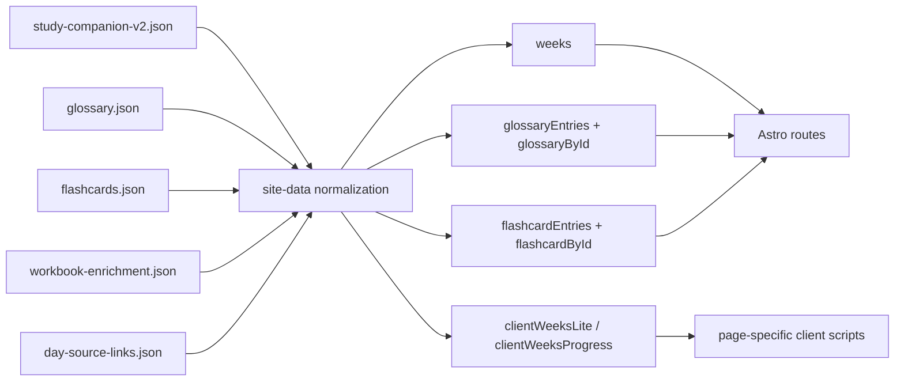
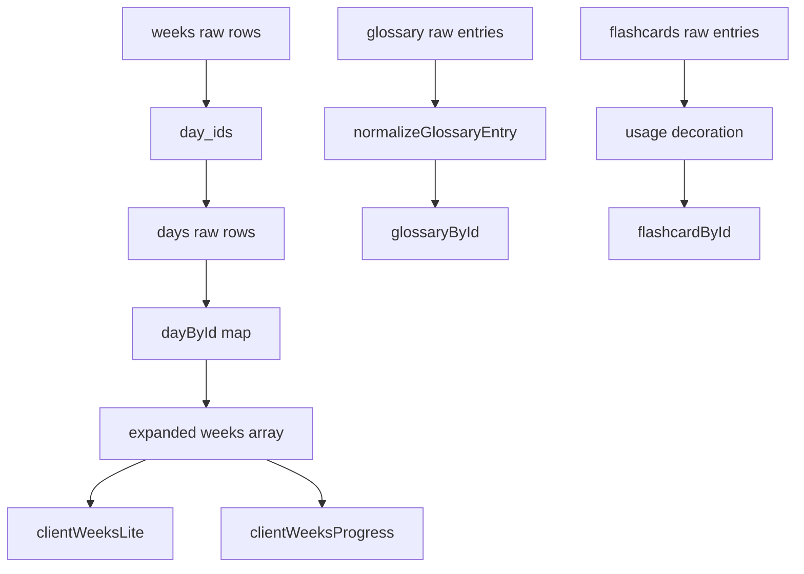

# 03 Data Model and Content Pipeline

## Purpose of this document

Explain the canonical data files, how IDs connect them, how `src/lib/site-data.js` normalizes them, and why the app can stay static while still feeling structured.

## What to inspect in the repo first

- `src/data/content/study-companion-v2.json`
- `src/data/content/glossary.json`
- `src/data/content/flashcards.json`
- `src/data/workbook-enrichment.json`
- `src/data/day-source-links.json`
- `src/lib/site-data.js`
- `tools/upgrade-glossary-to-concept-model.mjs`
- `scripts/validate_glossary_model.mjs`

## Observed implementation

`study-companion-v2.json` is the primary content graph. Current top-level collections are:

- `site`
- `core_pages`
- `resources`
- `weeks`
- `days`
- `security_journal_prompts`
- `portfolio_outputs`
- `review_decks`
- `metadata`

The current counts are:

- 32 weeks
- 224 days
- 32 journal prompts
- 32 portfolio outputs
- 32 review decks
- 27 resources

The app avoids duplicating whole glossary or flashcard records inside each day. Instead, day objects store `glossary_ids` and `flashcard_ids`, and `src/lib/site-data.js` resolves those IDs against `glossaryById` and `flashcardById`.

## Data flow diagram



## Canonical shapes

### `study-companion-v2.json`

### Observed implementation

`src/lib/site-data.js` treats it as a canonical content bundle:

```js
const canonicalData = {
  site: contentModel.site,
  core_pages: contentModel.core_pages,
  resources: contentModel.resources,
  weeks: contentModel.weeks,
  days: contentModel.days,
  security_journal_prompts: contentModel.security_journal_prompts,
  portfolio_outputs: contentModel.portfolio_outputs,
  review_decks: contentModel.review_decks,
  metadata: contentModel.metadata
};
```

The most important relationship is `weeks -> day_ids -> days`, not nested week/day JSON authored inline.

### `glossary.json`

### Observed implementation

The glossary has already migrated to a richer concept model. Each entry now contains:

- `id`
- `term`
- `category`
- `definition`
- `purpose`
- `mechanism`
- `model`
- `bullets`

`src/lib/site-data.js` still keeps `bullets` as the UI-facing contract through `normalizeGlossaryEntry()`.

### `flashcards.json`

### Observed implementation

The flashcards file now contains four card types per glossary term:

- `definition`
- `mechanism`
- `comparison`
- `scenario`

Usage metadata is not authored directly in the file. `src/lib/site-data.js` derives `phase_refs`, `week_refs`, and `day_refs` by scanning canonical day assignments.

## Small code excerpt: normalization and derived usage

From `src/lib/site-data.js`:

```js
const glossaryEntries = glossaryData.map((rawEntry) => {
  const entry = normalizeGlossaryEntry(rawEntry);
  const usage = glossaryUsageById.get(entry.id);
  const phase_refs = usage
    ? [...usage.phase_refs].sort((a, b) => phaseOrder.indexOf(a) - phaseOrder.indexOf(b))
    : [];
  const week_refs = usage ? [...usage.week_refs].sort((a, b) => a - b) : [];
  const day_refs = usage ? [...usage.day_refs].sort() : [];

  return {
    ...entry,
    phase_refs,
    week_refs,
    day_refs
  };
});
```

What this proves:

- authored data stays small and canonical
- route/query metadata is derived in one place
- downstream pages do not have to recompute usage relationships

## How it works step by step

1. Import raw JSON files.
2. Normalize days into `dayById`.
3. Expand weeks by joining `day_ids` against `dayById`.
4. Join portfolio outputs and review decks by week number.
5. Scan day assignments to build glossary and flashcard usage maps.
6. Normalize glossary entries and decorate them with usage refs.
7. Decorate flashcards with usage refs.
8. Export prefiltered client payloads like `clientWeeksLite` and `clientWeeksProgress`.

## Example of why ID mapping matters

### Observed implementation

In `src/pages/weeks/[...slug].astro`, the day card does not carry raw glossary records in the canonical week JSON. Instead it resolves IDs just before rendering:

```astro
<DayCard
  day={day}
  glossaryEntries={day.glossary_ids.map((id) => glossaryById.get(id)).filter(Boolean)}
  flashcardEntries={day.flashcard_ids.map((id) => flashcardById.get(id)).filter(Boolean)}
/>
```

### Likely rationale / trade-off

This avoids duplicating glossary/flashcard text across 224 days. The trade-off is an extra join step during route generation.

### Skill takeaway

Use IDs to keep authored content canonical. Use normalization to build route-ready objects.

## Content generation and migration scripts

### Observed implementation

The repo contains content tooling beyond runtime rendering:

- `tools/generate-v2-content.mjs` generates the main study content file
- `scripts/audit_flashcards.mjs` validates flashcard quality/coverage
- `tools/upgrade-glossary-to-concept-model.mjs` upgrades glossary entries to the concept-model shape
- `scripts/validate_glossary_model.mjs` enforces glossary structure rules

### Likely rationale / trade-off

The content system is treated like source code. That increases repo size and script count, but it gives reproducibility and diffable changes without introducing a CMS.

### Skill takeaway

For static apps with rich authored content, data tooling becomes part of the architecture, not an afterthought.

## Mermaid diagram: route-friendly object graph



## Likely rationale and trade-offs

- Precomputed JSON avoids backend complexity.
- A single normalization layer keeps route files simpler.
- The cost is that `site-data.js` becomes highly central; if it breaks, many pages break together.

## Common pitfalls or failure modes

- Editing raw JSON without understanding how derived usage refs are computed.
- Treating `bullets` as the only glossary contract after the concept-model migration.
- Forgetting that route payloads often use the normalized exports, not the raw files directly.

## How to extend it safely

- Add new content fields to the raw JSON.
- Normalize them in `src/lib/site-data.js`.
- Update only the routes/components/scripts that actually need the new field.
- Add or update validation scripts when the schema changes.

## Skill takeaway

This repo shows a practical content pipeline: raw JSON as source, a single normalization module as the compiler, and route-specific payloads as the runtime interface.

## Mini exercises / code reading prompts

1. Trace how `day_ids` become `week.days`.
2. Trace how a glossary term gains `phase_refs`.
3. Compare raw `glossary.json` entries to `normalizeGlossaryEntry()` output.

