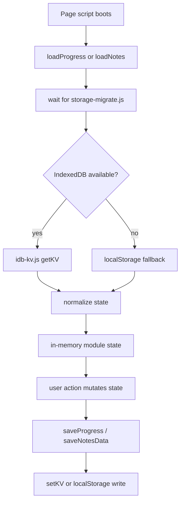

# 04 Client State and Persistence

## Purpose of this document

Explain how local progress and notes are stored, migrated, exported, imported, reset, and rendered.

## What to inspect in the repo first

- `src/scripts/idb-kv.js`
- `src/scripts/storage-migrate.js`
- `src/scripts/progress-storage.js`
- `src/scripts/progress-metrics.js`
- `src/scripts/progress-page.js`
- `src/scripts/notes-storage.js`
- `src/scripts/notes-page.js`

## Observed implementation

The repo now uses IndexedDB as the primary persistence backend. `src/scripts/idb-kv.js` opens database `cyber-study-db` with object store `kv`. Both progress and notes modules write logical keys into that single key-value store.

Legacy localStorage keys still exist as migration and fallback paths:

- progress: `cyber-study-progress-v1`
- notes: `cyber-study-notes-v2`
- note export meta: `cyber-study-note-export-meta-v1`

The active IndexedDB keys are:

- `progress`
- `notes`
- `noteExportMeta`
- `migrations`

## Storage flow diagram



## Progress state

### State shape

From `src/scripts/progress-storage.js`:

```js
const defaultProgress = () => ({
  completedDays: [],
  completedWeeks: [],
  blockedDays: [],
  artifactLinks: {},
  weekReflections: {},
  updatedAt: nowIso()
});
```

### Read flow

1. `loadProgress()` waits for `migrationReady`.
2. It reads IndexedDB key `progress` if possible.
3. Otherwise it reads legacy localStorage key `cyber-study-progress-v1`.
4. It normalizes array uniqueness and object shapes.
5. The module caches the result in `progressState`.

### Write flow

1. Route scripts call helpers like `setDayCompleted()`, `setDayBlocked()`, `setWeekCompleted()`, `setWeekReflection()`, or `setWeekArtifactLink()`.
2. Each helper mutates the in-memory state object.
3. `saveProgress()` rebuilds a normalized snapshot with a fresh `updatedAt`.
4. `persistState()` writes to IndexedDB or localStorage fallback.

### Export flow

`exportProgressBundle()` returns:

- `exportedAt`
- `version`
- `progress`

`src/scripts/progress-page.js` then uses `downloadJson()` to save the bundle.

### Reset flow

`resetAllProgress()`:

- resets in-memory state
- deletes IndexedDB key `progress` if IDB is available
- removes legacy localStorage key

### Failure modes / edge cases

- Malformed imported JSON triggers an error path in `importProgressBundle()`.
- IndexedDB open failure falls back to localStorage.
- A blocked day is automatically removed from `completedDays`, and a completed day is removed from `blockedDays`. This avoids contradictory state.

## Notes state

### State shape

From `src/scripts/notes-storage.js`:

```js
const defaultNotes = () => ({
  version: 'v2',
  dayNotes: {},
  weekReflections: {},
  securityJournalEntries: [],
  updatedAt: nowIso()
});
```

There is also separate export metadata:

```js
const defaultExportMeta = () => ({
  lastMarkdownExportAt: '',
  lastJsonExportAt: '',
  updatedAt: nowIso()
});
```

### Read flow

1. `loadNotes()` waits for storage migration.
2. It reads IndexedDB keys `notes` and `noteExportMeta` if possible.
3. Otherwise it reads legacy localStorage keys.
4. It normalizes day notes, week reflections, and journal entries.

### Write flow

Main write helpers:

- `setDayNote(dayId, payload)`
- `setWeekReflection(weekId, payload)`
- `upsertJournalEntry(payload)`
- `deleteJournalEntry(entryId)`
- `setExportMeta(nextValue)`

All writes funnel through `saveNotesData()` or `persistNotes()`.

### Export flow

- JSON export uses `exportNotesBundle()`.
- Markdown export uses `exportNotesMarkdown({ weeks, dayMetaById })`.

Markdown export is notable because it joins persisted note content with route metadata so the exported file contains week/day headings and labels.

### Reset flow

`resetNotesData()`:

- resets notes state
- resets export metadata state
- deletes IndexedDB keys `notes` and `noteExportMeta`
- removes legacy localStorage keys

### Failure modes / edge cases

- Empty day notes with status `Not started` are deleted rather than stored.
- Empty week reflections are deleted rather than stored.
- Imported bundles can be either nested under `notes` or contain legacy root-level note fields.
- Journal entry ids are generated client-side if missing.

## Small code excerpt: storage migration boundary

From `src/scripts/storage-migrate.js`:

```js
for (const [nextKey, legacyKey] of Object.entries(LEGACY_KEYS)) {
  const existing = await getKV(nextKey);
  const legacyValue = localStorage.getItem(legacyKey);
  if (existing != null || !legacyValue) continue;

  try {
    await setKV(nextKey, JSON.parse(legacyValue));
  } catch {
    // Ignore malformed legacy data and leave the fallback copy untouched.
  }
}
```

What this proves:

- migration is one-way copy, not destructive move
- malformed old data is tolerated
- the new storage layer does not depend on a backend migration job

## Where browser storage boundaries are intentionally separated

### Observed implementation

- Progress state lives in `progress-storage.js`
- Notes state lives in `notes-storage.js`
- Theme preferences live separately in localStorage through `color-theme.js` and `font-theme.js`

### Likely rationale / trade-off

This avoids one giant user-state blob. The trade-off is more keys and more modules, but smaller failure domains.

### Skill takeaway

Separate state by product boundary and mutation pattern, not just by storage technology.

## What changes if the app moves to a backend

### Likely rationale / trade-off

If the app gained accounts and sync:

- `idb-kv.js` could become a cache layer instead of the source of truth
- progress and notes modules would need async fetch/sync conflict handling
- export/import flows would become optional convenience features rather than the only backup strategy

The current design avoids all of that complexity by accepting single-device state.

## Common pitfalls or failure modes

- Assuming the localStorage keys are still the main write path.
- Forgetting to call `loadProgress()` or `loadNotes()` before reading state.
- Changing state shape without updating normalization functions.

## How to extend it safely

- Add fields to the default state constructor.
- Normalize them in one place.
- Update export/import logic explicitly.
- Keep migration tolerant of missing older fields.

## Skill takeaway

This repo teaches a pragmatic local persistence architecture: tiny IDB wrapper, module-level state, schema normalization, and explicit import/export/reset utilities.

## Mini exercises / code reading prompts

1. Trace one “complete day” click from `src/components/DayCard.astro` to IndexedDB.
2. Trace one Markdown notes export from the Notes page to the generated file content.
3. Explain why `storage-migrate.js` runs from `Layout.astro` instead of a specific page.

