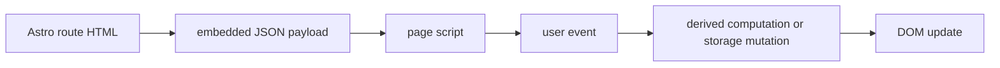

# 05 Feature Deep Dives

## Purpose of this document

Walk through the major user-facing features at the code level: where they start, what data they use, what state changes, and how the DOM updates.

## What to inspect in the repo first

- `src/pages/index.astro`
- `src/pages/roadmap/index.astro`
- `src/pages/weeks/[...slug].astro`
- `src/pages/glossary/index.astro`
- `src/pages/flashcards/index.astro`
- `src/pages/progress/index.astro`
- `src/pages/notes/index.astro`
- `src/scripts/`

## Feature flow diagram



## Home dashboard and “today” logic

### Observed implementation

`src/pages/index.astro` serializes `clientWeeksLite` into `home-data-json`. `src/scripts/home-page.js`:

- loads progress
- computes metrics with `computeProgressMetrics()`
- sets current phase/week labels
- updates the “current week” CTA
- updates the “today” link to the next unfinished day anchor

### How it works step by step

1. Parse `home-data-json`.
2. Read persisted progress.
3. Compute `metrics.nextTask` and `metrics.nextDeliverableWeek`.
4. Patch `.js-current-*` and `.js-today-link`.

### Modularity

- Good: metric computation lives in `src/scripts/progress-metrics.js`.
- Coupling: the script depends on many hard-coded CSS selectors in the home page markup.

### Safe extension idea

Add a “blocked items” teaser to the home page by reusing `computeProgressMetrics().blockedItems`.

## Weeks archive filtering and unlock state

### Observed implementation

The archive is `/roadmap/`, not `/weeks/`. `src/components/PhaseTimeline.astro` renders grouped `WeekCard` components. `src/scripts/roadmap-page.js` computes unlock state and progress text for each card.

### State changes

- user toggles a week-complete checkbox
- `setWeekCompleted()` writes persistence
- `dispatchProgressChanged()` triggers rerender

### DOM updates

- toggles `.is-complete`
- toggles `.is-locked`
- updates progress label text
- enables/disables week open link

### Safe extension idea

Add phase-level collapse controls without touching persistence, because the route already groups weeks by phase.

## Week detail interactions

### Observed implementation

`src/pages/weeks/[...slug].astro` renders all day cards up front. `src/scripts/week-page.js` owns:

- lock gating against the previous week
- per-day complete/block toggles
- week complete toggle
- reflection/artifact saves
- week/day Anki exports

### How it works step by step

1. Parse `week-data-json`.
2. Determine whether the previous week is complete.
3. Hide or show lockable sections.
4. Attach per-day listeners.
5. Attach week reflection/artifact listeners.
6. Attach export listeners.

### Modularity

- Good: all week-specific behavior is in one file.
- Coupling: one script owns several concerns that could eventually be split if the page grows.

### Safe extension idea

Split export logic into `week-anki-export.js` only if week-page behavior becomes harder to read.

## Glossary filtering

### Observed implementation

`src/pages/glossary/index.astro` emits one wrapper per term with search and usage refs in `data-*` attributes. `src/scripts/glossary-page.js` applies search/category/phase/week filters and updates visible counts.

### How data enters

- normalized `glossaryEntries`
- derived option lists: `glossaryPhaseOptions`, `glossaryWeekOptions`, `glossaryCategoryOptions`

### DOM update pattern

Each card wrapper gets `hidden = true/false`, and each category section is hidden when all children are hidden.

### Safe extension idea

Add a “has comparison cards” filter by deriving flashcard coverage in `site-data.js`, not by scanning the DOM.

## Flashcards filtering and reveal UI

### Observed implementation

`src/pages/flashcards/index.astro` renders all cards with filter metadata. `FlashcardItem.astro` uses native `<details>` for answer reveal. `src/scripts/flashcards-page.js`:

- filters by text/phase/week/day/type/difficulty
- enables/disables export-visible button
- exports all or visible cards through `buildAnkiTsv()`

### Modularity

- Good: answer reveal uses HTML semantics rather than custom JS.
- Coupling: export settings are read from DOM each time rather than stored in a separate view model.

### Safe extension idea

Add “collapse all answers” only if user demand exists; the current native `<details>` approach keeps the implementation small.

## Progress dashboard calculations

### Observed implementation

`src/scripts/progress-page.js` is mostly a rendering adapter over `computeProgressMetrics()` from `src/scripts/progress-metrics.js`.

It renders:

- global percent complete
- next unfinished task
- next deliverable
- progress summary counters
- per-phase cards
- per-week cards
- blocked item list

### Safe extension idea

Add a “phase completion trend” chart only if you are willing to keep the dashboard script as the sole rendering owner.

## Notes tool export/import/reset

### Observed implementation

`src/pages/notes/index.astro` provides forms and selectors; `src/scripts/notes-page.js` wires them to `notes-storage.js`.

Important flows:

- Markdown export uses `exportNotesMarkdown()`
- JSON export uses `exportNotesBundle()`
- JSON import uses `importNotesBundle()`
- Reset uses `resetNotesData()`

### Modularity

- Good: persistence logic is separate from DOM logic.
- Coupling: `notes-page.js` still knows a lot about form field class names and query param rules.

### Safe extension idea

Add autosave carefully, because the current manual-save model reduces accidental state churn and simplifies import/export expectations.

## Font theme switching

### Observed implementation

`src/scripts/font-theme.js`:

- reads `cyber-study-typography-theme-v1`
- applies `document.documentElement.dataset.fontTheme`
- syncs all `.js-font-theme` selects

`src/scripts/color-theme.js` does the same for color theme controls with a legacy theme-name map.

### Modularity

- Good: theme behavior is globally reusable and not tied to one route.
- Coupling: select class names in Navbar and Footer are part of the public contract for these modules.

### Safe extension idea

Add a new typography preset in `src/lib/theme-options.js` and corresponding CSS variables in `src/styles/global.css`.

## Small code excerpt: DOM-plus-storage feature ownership

From `src/scripts/week-page.js`:

```js
completeToggle.addEventListener('change', async () => {
  const next = await setDayCompleted(dayId, completeToggle.checked);
  const currentlyBlocked = next.blockedDays.includes(dayId);
  blockedToggle.textContent = currentlyBlocked ? 'Unblock day' : 'Mark blocked';
  applyDayVisualState(card, completeToggle.checked, currentlyBlocked);
  stateText.textContent = completeToggle.checked ? 'Marked complete.' : 'Marked incomplete.';
  dispatchProgressChanged();
});
```

What this proves:

- the event starts in the page script
- persistence happens through a storage helper
- the script immediately patches the DOM
- a global progress event keeps other pages/components in sync

## Common pitfalls or failure modes

- Breaking selector names used by scripts.
- Moving fields between JSON payload and live DOM without updating the script.
- Adding persistence writes inside purely presentational modules.

## Skill takeaway

A feature in this repo is usually “Astro markup + narrow JSON payload + one script + one storage helper,” which is a strong pattern to recognize and reuse.

## Mini exercises / code reading prompts

1. Explain why `FlashcardItem.astro` does not need a JS file for reveal behavior.
2. Trace the flow from “Save Week Reflection” on a week page to persisted progress state.
3. Compare the Notes page architecture to the Week page architecture: where is state local, and where is it persistent?

